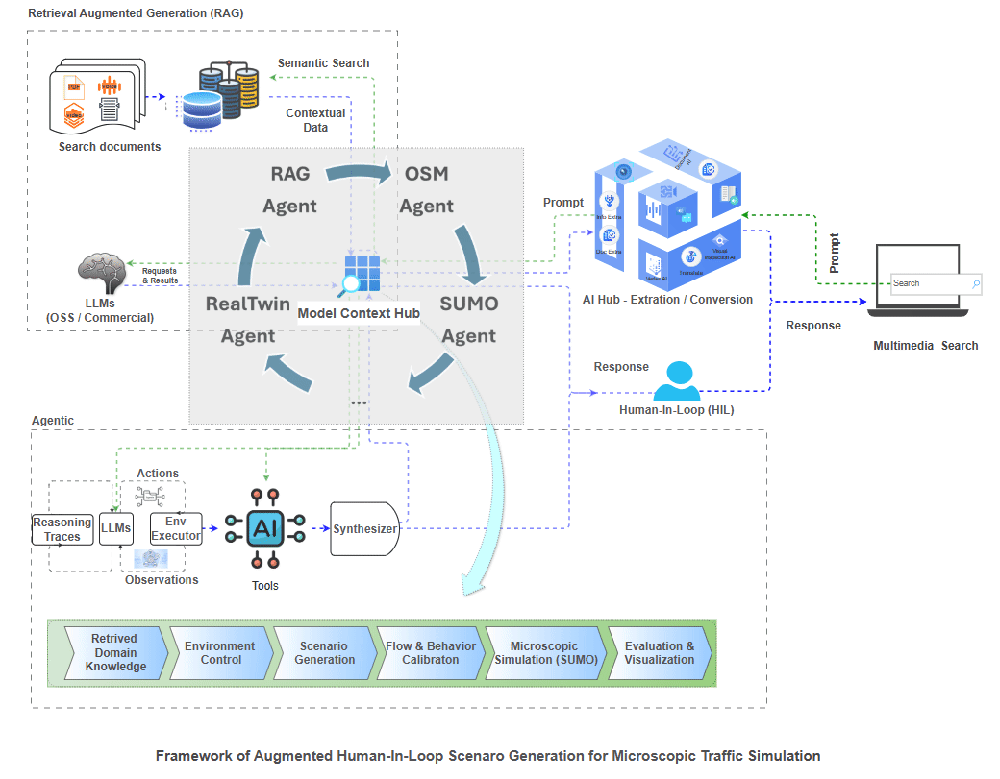
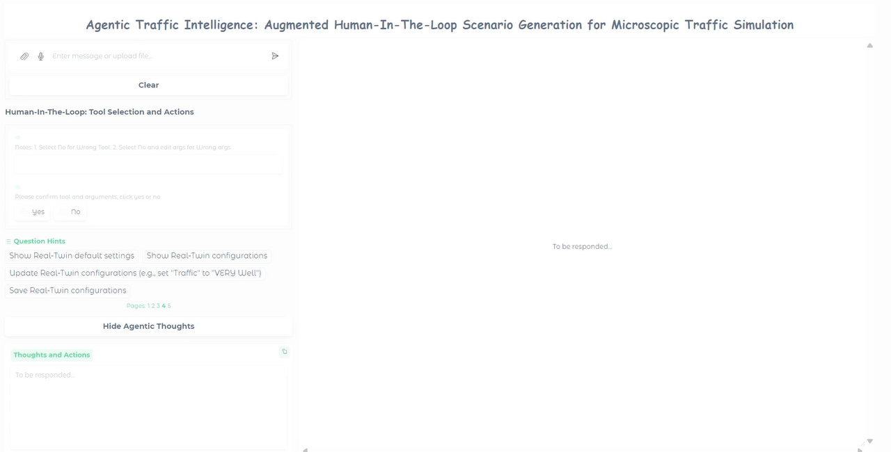

# **Agentic Traffic Intelligence: Augmented Human-in-the-Loop Scenario Generation for Microscopic Traffic Simulation**

## Introduction

Agentic Traffic Intelligence, which combines attention-enhanced large language models (LLMs), the Real-Twin tool, and multi-agent systems to perform realistic microscopic traffic simulation scenario generation.

The proposed framework incorporates human-in-the-loop (HIL) control, retrieval-augmented generation (RAG), and multi-agent control mechanisms. HIL mechanisms are used to guide multiple LLMs focused on attributes for microscopic simulation generation and to improve the interpretability and transparency of LLM execution for users. RAG enhances context extraction by dynamically integrating external knowledge sources for traffic scenario generation foundations. A multi-agent architecture with supervisory control coordinates the interaction of simulation components, including traffic simulators, control logic, and calibration tools. This enables the synthesis of simulation-ready scenarios that reflect dynamic demand profiles and behavior controls.

## The design framework of Agentic Traffic Intelligence




## Interface



## YouTube Video

[](https://www.youtube.com/watch?v=tkR8s11WwfU)

## Installation

### Prerequisites

- Python 3.10 or higher
- pip (Python package manager)

### Setup Instructions

1. **Create a virtual environment:**

   ```bash
   python -m venv venv
   ```

2. **Activate the virtual environment:**

   - **Windows:**

     ```bash
     venv\Scripts\activate.bat
     ```

   - **macOS/Linux:**

     ```bash
     source venv/bin/activate
     ```

3. **Upgrade pip:**

   ```bash
   python -m pip install --upgrade pip setuptools wheel
   ```

4. **Install dependencies:**

   ```bash
   pip install -r requirements.txt
   ```

## Usage

### Run the Application

1. **Activate the virtual environment (if not already activated):**

   - **Windows:**

     ```bash
     venv\Scripts\activate.bat
     ```

   - **macOS/Linux:**

     ```bash
     source venv/bin/activate
     ```

2. **Launch the Human-in-the-Loop (HIL) Chat Interface:**

   ```bash
   python chat_interface_hil.py
   ```

### Available Entry Points

- **`chat_interface_hil.py`** - Main Human-in-the-Loop chat interface with interactive scenario generation
